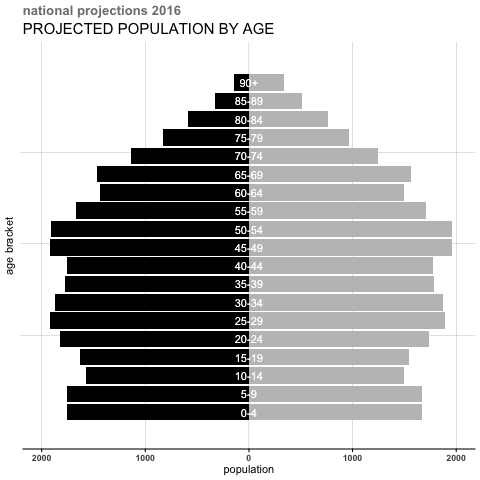
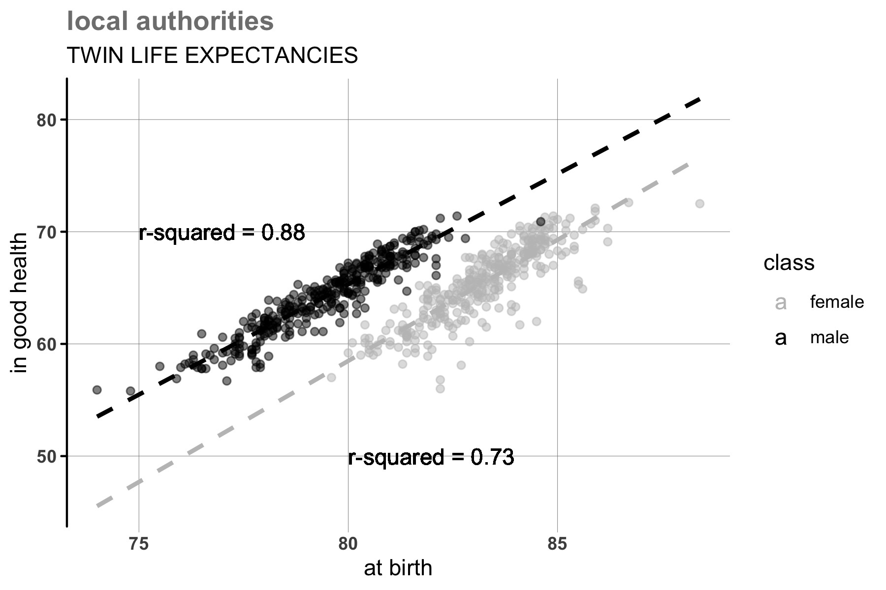

```{r setup, include = FALSE}

knitr::opts_chunk$set(echo = TRUE, warning = FALSE, 
                      message = FALSE, cache = TRUE)
```

[tl;dr: scroll through if you want to see some techniques for spatial analysis or for making presentable maps in R]

# [1]

## what are we doing?

The United Kingdom, as part of its set of Grand Challenges missions, is seeking *"to ensure that people can enjoy at least five extra healthy, independent years of life by 2035, whilst narrowing the gap between the experience of the richest and poorest"*. 

Independence could mean any number of things, but perhaps an easy starting point is health: a healthy individual is likely more able than an unhealthy one. Thus to approach the challenge, we could start by finding out what is the relationship between the difference in healthspan and lifespan and socio-spatial conditions---that is, what circumstances surround varitions in poor health. What variables associate with a life that is both *healthy* and *long*, or at the very least healthy for its duration, compared to lives that are long but unhealthy or simply short? With a better understanding of these, we can allign policies to suit the needs of an ageing society.

A technique called geographically weighted regression can shed light on spatial variations in the phenomenon. How do correlates of poor health vary in their relation to it across geographies. 

## you and what data? 

The data comes from the Office of National Statistics, [which collates both lifespan aand healthy lifespan](https://www.ons.gov.uk/peoplepopulationandcommunity/healthandsocialcare/healthandlifeexpectancies/datasets/healthstatelifeexpectanciesgeneralhealthforenglandbycountrydecileanduppertierlocalauthorityutlaformalesandfemalesatbirthandmenandwomenatage652010to2012) at the level of the local authority---and thus we take this geography as our unit of analysis. From there, we add in controls from the Consumer Data Research Centre, which compiles correlates of health in their [AHAH index](https://data.cdrc.ac.uk/). While the index uses dozens of variables, we select a few. We augment these with median income and some demographic dynamics, also from ONS, like [income](https://www.ons.gov.uk/economy/regionalaccounts/grossdisposablehouseholdincome/datasets/regionalgrossdisposablehouseholdincomegdhibylocalauthorityintheuk).

The following analysis draws on much research and many packages, which I load into the script as needed so that users can see what each package's role is in the analysis. Given the need to read and clean data from inside, the following come are necessary early and often. 

``` {r packages}

library(tidyverse)
library(readxl)
library(janitor)

```

I am also rather terrible at selecting palettes for work, so I chose randomly from the package `scico`, which offers an area of gradients that are, apparently, easier on the eyes than other palettes. You can pick your own if so inclined. 

As a final aesthetic consideration, all of the themes that I use are at the end of this document. 

``` {r scico}

library(scico)

scico_palette_show()

```

# [2]

## just how aged?

Over the next two decades, the poplulation of England is expected to age and age some more. We can start by reading in projections from the government regarding population growth for the coming decades. The following code selects two sheets from the same file and binds them together to create a long data frame. 

``` {r population data}

national_ages <-
  bind_rows(read_xls("data/aging.xls", skip = 5, sheet = 2) %>%
              clean_names() %>%
              filter(area == "England" & age_group != "All ages") %>%
              separate(age_group, sep = "-", into = c("lower", "upper")) %>%
              replace_na(list("upper" = 94)) %>%
              mutate(upper = as.numeric(upper)) %>%
              select(upper, x2016:x2041) %>%
              gather(year, population, x2016:x2036) %>%
              mutate(population = population * -1, group = "male"),
            read_xls("data/aging.xls", skip = 5, sheet = 3) %>%
              clean_names() %>%
              filter(area == "England" & age_group != "All ages") %>%
              separate(age_group, sep = "-", into = c("lower", "upper")) %>%
              replace_na(list("upper" = 94)) %>%
              mutate(upper = as.numeric(upper)) %>%
              select(upper, x2016:x2041) %>%
              gather(year, population, x2016:x2036) %>%
              mutate(group = "female"))

```

Note that in order to plot this as a population pyramid, we have multiplied the male bins by a negative to flip their direction on the pyramid. We now have data where each row represents an age bin with populations, male and female.  

``` {r animate}

library(gganimate)

```

To plot this, we can draw on the same code above to create data frame that is simply the bins, which will allow for labels down the middle of the pyramid, rather than off on one of the axes. We can also load in the `gganimate` package, which adds a few arguments to the `ggplot` syntax and animates according to a variable---in this case years. With gender, age bins, *and* population, we could either use small multiplies or animations to incorporate time; I opt for the latter. 

``` {r population, include = FALSE}

theme_pop <- function () {
  theme_minimal() +
    theme(plot.background = element_rect(fill = 'transparent', colour = 'transparent'),
          panel.grid.major.y = element_line(size = 0.1, colour = 'grey50'),
          panel.grid.major.x = element_line(size = 0.1, colour = 'grey50'),
          panel.grid.minor.y = element_blank(),
          panel.grid.minor.x = element_blank(),
          axis.line.x = element_line(size = 0.5, colour = 'black'),
          axis.line.y = element_blank(),
          axis.ticks.x = element_line(size = 0.5, colour = 'black'),
          axis.ticks.y = element_line(size = 0.1, colour = 'grey50'),
          axis.text.x = element_text(face = 'bold'),
          axis.text.y = element_text(face = 'bold'),
          plot.title = element_text(face = 'bold', colour = 'grey50'),
          plot.subtitle =  element_text(face = 'plain', colour = 'black', size = 15),
          strip.text = element_text(face = 'bold', colour = 'black'),
          plot.margin = margin(5, 5, 5, 5)
    )
}


```

``` {r}

groups <- 
  read_xls("data/aging.xls", skip = 5, sheet = 2) %>%
  clean_names() %>%
  filter(area == "England" & age_group != "All ages") %>%
  separate(age_group, sep = "-", into = c("lower", "upper"), remove = FALSE) %>%
  replace_na(list("upper" = 94)) %>%
  mutate(upper = as.numeric(upper)) %>%
  select(age_group, lower, upper) %>%
  group_by(age_group) %>%
  slice(1)

national_aging <- 
  ggplot(national_ages %>%
           left_join(groups) %>%
           mutate(year = str_replace_all(year, pattern = "x", replacement = ""))) +
  geom_bar(aes(y = population, x = upper, fill = group), stat = 'identity',
           show.legend = FALSE) +
  geom_text(aes(x = upper, y = 0, label = age_group), colour = '#ffffff') +
  scale_fill_manual(values = c(scico(palette = "grayC", 10)[3], 
                               scico(palette = "grayC", 10)[10])) +
  scale_y_continuous(labels = abs, 
                     limits = max(national_ages$population, na.rm = TRUE) * c(-1, 1)) +
  scale_x_continuous(labels = c("", "", ""), 
                     breaks = c(25, 50, 75), 
                     limits = c(-1, 100)) +
  transition_states(year) +
  ease_aes('linear') +
  labs(title = "national projections {closest_state}",
       subtitle = "PROJECTED POPULATION BY AGE",
       x = "age bracket", y = "population") +
  coord_flip() +
  theme_pop()

```

We can save this plot as a GIF using the `anim_save` function. 

``` {r saving, eval = FALSE}

anim_save(national_aging, filename = "aging.gif")

```

With this animated, we can see that the elderly population will swell, with women outlasting men and thus with their ranks growing more. Not only does the pyramid buldge at the top as the years tick by, it does so particularly on the female side.   

<center>



</center>

So people in England are living longer than ever before and projections suggest they will continue to live longer and longer. Next, we can look at the variations in this trend; to do this, we will read in data on local authorities that separates healthspan and lifespan for men and women.

## just who aged?

``` {r health}

expectancy <- 
  read_xls("data/healthy.xls", skip = 10, sheet = 1) %>%
  clean_names()

glimpse(expectancy)

```

We have columns for life expectancy and for healthy life expectancy, and rows for each local authority in England, which we can difference to estimate years in poor health for different areas. 

``` {r magritte}

library(magrittr)

```

We can fit a model life against healthy life to see the association between the two, grabbing the r-squared value---the amount by which variation in one explains the other---to append to a bivariate plot to come. To pull something out of an object a la the `$` operator within a pipe, the `use_series` function is an option. 

```{r models}

lm(healthy_life_expectancy_for_females_2009_2013_years ~ life_expectancy_at_birth_for_females_2009_2013, 
   data = expectancy) %>%
  summary() %>%
  use_series("r.squared")

lm(healthy_life_expectancy_for_males_2009_2013 ~ life_expectancy_at_birth_for_males_2009_2013, 
   data = expectancy) %>%
  summary() %>%
  use_series("r.squared")

```

There is a better model fit for men than women, meaning that lifespan largely explains healthspan for men but not women. The coefficient for women is larger for women, so an additional year of life begets an additional two years of healthy life, but plotting this relationship reveals a subtler issue.   

``` {r vertical, include = FALSE}

theme_ver <- function () {
  theme_minimal() +
    theme(plot.background = element_rect(fill = 'transparent', colour = 'transparent'),
          panel.grid.major.x = element_line(size = 0.1, colour = 'grey50'),
          panel.grid.major.y = element_line(size = 0.1, colour = 'grey50'),
          panel.grid.minor.x = element_blank(),
          panel.grid.minor.y = element_blank(),
          axis.line.y = element_line(size = 0.5, colour = 'black'),
          axis.line.x = element_blank(),
          axis.ticks.y = element_line(size = 0.5, colour = 'black'),
          axis.ticks.x = element_line(size = 0.1, colour = 'grey50'),
          axis.text.x = element_text(face = 'bold'),
          axis.text.y = element_text(face = 'bold'),
          plot.title = element_text(face = 'bold', colour = 'grey50'),
          plot.subtitle =  element_text(face = 'plain', colour = 'black'),
          strip.text = element_text(face = 'bold', colour = 'black'),
          plot.margin = margin(5, 5, 5, 5)
    )
}

```
``` {r difference}

plot_expectancies <- 
  ggplot(bind_rows(select(expectancy, 
                          healthy_life_expectancy_for_females_2009_2013_years,
                          life_expectancy_at_birth_for_females_2009_2013) %>%
                     set_names(c("in good health", "at birth")) %>%
                     mutate(class = "female"),
                   select(expectancy, healthy_life_expectancy_for_males_2009_2013,
                          life_expectancy_at_birth_for_males_2009_2013) %>%
                     set_names(c("in good health", "at birth")) %>%
                     mutate(class = "male")), 
         aes(x = `at birth`, y = `in good health`, colour = class)) +
  geom_point(alpha = 0.5, show.legend = FALSE) +
  geom_smooth(method = lm, se = FALSE, fullrange = TRUE, 
              linetype = 2, show.legend = FALSE) +
  geom_text(aes(x = 75, y = 70, label = "r-squared = 0.88"), hjust = 0) +
  geom_text(aes(x = 80, y = 50, label = "r-squared = 0.73"), hjust = 0) +
  scale_colour_manual(values = c(scico(palette = "grayC", 10)[3], 
                                 scico(palette = "grayC", 10)[10])) +
  labs(title = "local authorities",
       subtitle = "TWIN LIFE EXPECTANCIES") +
  theme_ver()

```

In the above block, we take wide data---with separate columns for men and women---and make it long, so that each variable, in this case lifespan and healthspan, has a column and each value has a row, with identifiers for male and female. This involves splitting the data temporarily, creating identitical column names for binding, and joining it back together.  



The trend for female expectancies is shifted, indicating that women live longer than men, but it is only East rather than Northeast on the cartesian coordinate plane, suggesting that women are by no means guaranteed more healthy years than men. That is, a striking idea, women live longer than men, but *most if not all* of those marginal additional years are spent in ill health. 

## just where aged? 

So the gains that women have over men are entirely explained with years of poor health, but how this trend plays out across space is another matter. Because we have rows for each authority in the above data, we can combine with a **shapefile** that has the same, information regarding spatial data bolted on. In order to see the variations across geographies, we need to pull in a new package, the `sf` package for manipulating **simple features**. 

``` {r sf}

library(sf)

```

One of the appeals of this package, compared to, say, `sp`, is that it affords us the ability to toggled between spatial and aspatial formats while maintaining a legible tabular form. 

``` {r authorities}

authorities <-
  st_read("data/authorities_WGS84.geojson") %>%
  clean_names() %>%
  rename(code = lad17cd) %>%
  select(code, st_areashape, st_lengthshape)

```

We change the name of the unique identifier to match the corresponding column in our healthspan-lifespan data and, with these geographies loaded into the environment, we can join the two. 

``` {r joining}

expectancy_spatially <- 
  expectancy %>%
  left_join(authorities) %>%
  drop_na() %>%
  st_as_sf()

```

We join it by matching the "code" columns and then establish that the geometry column is indeed an `sf` object. Note that when you aggregate an `sf` object, it preserves the geometry column performs what would be called a `dissolve` operation in QGIS or ArcGIS. 

``` {r background}

background <- 
  authorities %>%
  mutate(dissolve = 1) %>%
  group_by(dissolve) %>%
  summarise()

```

This background shape now only have one row but it takes on the exterior lines of all 350 odd authorities while dissolving the interior ones. 

``` {r include = FALSE}

theme_map <- function () {
  theme_void() + 
    theme(plot.background = element_rect(fill = 'transparent', colour = 'transparent'),
          panel.grid.major.x = element_blank(),
          panel.grid.major.y = element_blank(),
          panel.grid.minor.x = element_blank(),
          panel.grid.minor.y = element_blank(),
          panel.grid.major = element_line(size = NA), 
          panel.grid.minor = element_line(size = NA),
          axis.line.x = element_blank(),
          axis.line.y = element_blank(),
          axis.ticks.x = element_blank(),
          axis.ticks.y = element_blank(),
          axis.text.x = element_blank(),
          axis.text.y = element_blank(),
          plot.title = element_text(face = 'bold', colour = 'grey50'),
          plot.subtitle =  element_text(face = 'plain', colour = 'black', size = 15),
          plot.caption = element_text(face = 'bold', colour = 'black'),
          strip.text = element_text(face = 'bold', colour = 'black'),
          legend.title = element_text(face = 'bold', colour = 'grey50', angle = 270),
          legend.text = element_text(colour = 'black', angle = 270),
          plot.margin = margin(5, 5, 5, 5)
    )
  
}

guide_continuous <- 
  guide_colorbar(direction = "vertical",
                 barheight = unit(50, units = "mm"),
                 barwidth = unit(2, units = "mm"),
                 draw.ulim = FALSE,
                 title.position = 'right',
                 label.position = 'left',
                 title.hjust = 0.5,
                 label.hjust = 0.5)

```

``` {r mapping}

map_differences <- 
  ggplot(data =
         expectancy_spatially %>%
         mutate(difference_male = life_expectancy_at_birth_for_males_2009_2013 - healthy_life_expectancy_for_males_2009_2013,
                difference_female = life_expectancy_at_birth_for_females_2009_2013 - healthy_life_expectancy_for_females_2009_2013_years) %>%
         select(difference_female, difference_male) %>%
         gather(variable, value, difference_male:difference_female) %>%
         mutate(name = case_when(variable == "difference_male" ~ "male",
                                 variable == "difference_female" ~ "female")) %>%
         select(variable, name, value, geometry)) +
  geom_sf(data = background,
          aes(), 
          fill = 'grey70', colour = NA, size = 0) +
  geom_sf(aes(fill = value), 
          colour = NA, size = 0) +
  scale_fill_scico(palette = 'lajolla', direction = 1,
                   guide = guide_continuous) +
  facet_wrap(~ name) +
  labs(title = "local authorities",
       subtitle = "DIFFERENCES WITH HEALTHSPAN AND LIFESPAN") +
  theme_map()

```

There is a distinct geography to the healthspan-lifespan diference for both men and women, with similar clusters of differing magnitudes.


# [3]

## think global

The map suggests clustering in the data, but we can test this statistically using the Moran's I test of **spatial autocorrelation**. This, roughly, looks at deviation from the mean in a variable of interest across space.   

#### global spatial autocorrelation
$$
I=\frac{N}{W} \frac{\sum_{i} \sum_{j} w_{i j}\left(x_{i}-\overline{x}\right)\left(x_{j}-\overline{x}\right)}{\sum_{i}\left(x_{i}-\overline{x}\right)^{2}}
$$

In order to understand the spatial relations inherent in any given map, we need to impose a structure: the number of neighbours to consider when assessing autocorrelation. This takes the form of a weights matrix $w$, a sort of sliding window of analysis, which can be produced using the `spdep` package.    

``` {r}

library(spdep)

```

We will look at the presence or absence of spatial autocorrelation for the difference in healthspan and lifespan, preparing a data frame accordingly.

```{r}

autocorrelating <- 
  expectancy %>%
  mutate(difference_male = life_expectancy_at_birth_for_males_2009_2013 - healthy_life_expectancy_for_males_2009_2013,
         difference_female = life_expectancy_at_birth_for_females_2009_2013 - healthy_life_expectancy_for_females_2009_2013_years) %>%
  mutate(difference = ((difference_male + difference_female) / 2)) %>%
  left_join(authorities) %>%
  st_as_sf()

```

Determining nearest neighbours using Euclidean distance requires coordinates for each authority; we opt for the centroids and calculate the five nearest neighbours before creating the weight matrix.

```{r}

coords <- 
  autocorrelating %>%
  st_centroid() %>%
  st_coordinates()

nearest <- knn2nb(knearneigh(coords, 5))
weights <- nb2listw(nearest, style = "W")

```

We can either run a Moran test or a Moran simulation; both will yield an estimate of the I value. 

```{r}

moranstest <- moran.test(autocorrelating$difference, weights)
montecarlo <- moran.mc(autocorrelating$difference, weights, nsim = 999)

moranstest

```

The Monte Carlo simulation, however, allows us to show visually just how likely or unlikely a given pattern is. 

```{r}

plot_montecarlo <- 
  ggplot(as.data.frame(montecarlo$res), aes(montecarlo$res)) + 
  geom_histogram(binwidth = 0.01) +
  geom_vline(aes(xintercept = 0.466), colour = "grey70",size = 1) +
  scale_x_continuous(limits = c(-1, 1)) +
  labs(title = "observed and permuted Moran's I",
       subtitle = "I = 0.466 | P < 0.01",
       x = "results",
       y = "count") +
  theme_ver()

```

We affirm the test results and confirm our intuitions here running a Monte Carlo simulation for comparison. The Monte Carlo simulation simply shakes up the map 999 times, computing the I statistic each time. If the number we have is far out on the tails of this simulaton, we can be confident that our map did not occur by chance. 


## act local

We can also check local Moran's I values to find specific clusters. Sometimes called **local indicators o spatial autocorrelation**, local Moran's I evaluates the patterns within each window of analysis and, critically, calculates statistical significance for each. Because the sample is confined, only stronger effects register.       

#### local spatial autocorrelation
$$
I_i = \frac{(x_i-\bar{x})}{{∑_{k=1}^{n}(x_k-\bar{x})^2}/(n-1)}{∑_{j=1}^{n}w_{ij}(x_j-\bar{x})}
$$

With the preparation finished, local autocorrelation is another function call away.  

```{r}

moransi <- localmoran(autocorrelating$difference, weights) %>% as_tibble()

```

The test results are stored in a matrix containing the expected and computed Moran statistics along with variance, standard deviation and a p-value; the value and p-value are most important here. 

```{r}

autocorrelating <- 
  autocorrelating %>%
  bind_cols(moransi) %>%
  rename(locali = Ii,
         expectation = E.Ii,
         variance = Var.Ii,
         deviation = Z.Ii,
         p_value = `Pr(z > 0)`)

```

We can map the results along with our variable of interest to see where the clusters are and whether or not those clusters are statistically significant. 

```{r include = FALSE}

guide_discrete <-
  guide_legend(direction = "horizontal",
               keyheight = unit(2, units = "mm"),
               keywidth = unit(10, units = "mm"),
               title.position = 'top',
               label.position = 'bottom',
               title.hjust = 0.5,
               label.hjust = 1,
               nrow = 1,
               byrow = TRUE)

theme_map_legend <- function () {
  theme_void() + 
    theme(plot.background = element_rect(fill = 'transparent', colour = 'transparent'),
          panel.grid.major.x = element_blank(),
          panel.grid.major.y = element_blank(),
          panel.grid.minor.x = element_blank(),
          panel.grid.minor.y = element_blank(),
          panel.grid.major = element_line(size = NA), 
          panel.grid.minor = element_line(size = NA),
          axis.line.x = element_blank(),
          axis.line.y = element_blank(),
          axis.ticks.x = element_blank(),
          axis.ticks.y = element_blank(),
          axis.text.x = element_blank(),
          axis.text.y = element_blank(),
          plot.title = element_text(face = 'bold', colour = 'grey50'),
          plot.subtitle =  element_text(face = 'plain', colour = 'black', size = 15),
          plot.caption = element_text(face = 'bold', colour = 'black'),
          strip.text = element_text(face = 'bold', colour = 'black'),
          legend.position = 'bottom',
          legend.title = element_text(face = 'bold', colour = 'grey50'),
          legend.text = element_text(colour = 'black'),
          plot.margin = margin(5, 5, 5, 5)
    )
  
}

```

```{r}

map_moran_difference <- 
  ggplot() + 
  geom_sf(data = background,
          aes(), fill = 'grey70', colour = NA, size = 0) +
  geom_sf(data = autocorrelating,
          aes(fill = factor(ntile(difference, 5))), size = 0, colour = NA) +
  scale_fill_manual(values = scico(palette = 'cork', 5),
                    labels = as.character(quantile(autocorrelating$difference,
                                                   c(.1,.2,.4,.6,.8),
                                                   na.rm = TRUE)),
                    name = "difference",
                    guide = guide_discrete) +
  labs(title = "difference") +
  theme_map_legend()

map_moran_i <- 
  ggplot() + 
  geom_sf(data = background,
          aes(), fill = 'grey70', colour = NA, size = 0) +
  geom_sf(data = autocorrelating,
          aes(fill = factor(ntile(locali, 5))), size = 0, colour = NA) +
  scale_fill_manual(values = scico(palette = 'cork', 5),
                    labels = str_sub(as.character(quantile(autocorrelating$locali,
                                                           c(.1,.2,.4,.6,.8),
                                                           na.rm = TRUE)), 1, 4),
                    name = "i value",
                    guide = guide_discrete) +
  labs(title = "local moran's i") +
  theme_map_legend()

map_moran_p <- 
  ggplot() + 
  geom_sf(data = background,
          aes(), fill = 'grey70', colour = NA, size = 0) +
  geom_sf(data = autocorrelating,
          aes(fill = factor(ntile(p_value, 5))), size = 0, colour = NA) +
  scale_fill_manual(values = scico(palette = 'cork', 5),
                    labels = str_sub(as.character(quantile(autocorrelating$p_value,
                                                           c(.1,.2,.4,.6,.8),
                                                           na.rm = TRUE)), 1, 4),
                    name = "p value",
                    guide = guide_discrete) +
  labs(title = "p value") +
  theme_map_legend()  

```

The mapping yeilds some interesting patterns, with the lowest differences in the Southwest, along with the highest Moran values, and an area of high differences and high Moran values in the Northeast.


While plotting the p-values can suggest gradation in autocorrelation, we can improve the confidence with which we view these clusters by filtering out any that are not statistically significant. This is typically done through a map that shows areas where high values locate near other high values, where low values do so with low values, and where they mix.

```{r}

autocorrelating <- 
  autocorrelating %>%
  mutate(scaled_difference = scale(difference)) %>%
  select(difference, scaled_difference, locali, expectation, variance, deviation, p_value) %>%
  mutate(lagged_difference = lag.listw(weights, scaled_difference),
         quad_sig = NA)

autocorrelating <-
  autocorrelating %>%
  mutate(quad_sig = 
           case_when(scaled_difference >= 0 & lagged_difference >= 0 & p_value <= 0.05 ~ 1,
                     scaled_difference <= 0 & lagged_difference <= 0 & p_value <= 0.05 ~ 2,
                     scaled_difference >= 0 & lagged_difference <= 0 & p_value <= 0.05 ~ 3,
                     scaled_difference >= 0 & lagged_difference <= 0 & p_value <= 0.05 ~ 4,
                     scaled_difference <= 0 & lagged_difference >= 0 & p_value <= 0.05 ~ 5)) %>%
  st_as_sf()

```

Having prepared the data with a column that covers each statistically significant permutation of high-high, high-low, low-high, low-low, we can map the areas that qualify.

```{r}

map_quads <- 
  ggplot() + 
  geom_sf(data = background,
          aes(), fill = 'grey70', colour = NA, size = 0) +
  geom_sf(data = autocorrelating,
          aes(fill = factor(quad_sig)), size = 0, colour = NA) +
  scale_fill_manual(values = scico(palette = 'cork', 2),
                    name = "quadrants",
                    labels = c("high-high", "low-low"),
                    guide = guide_discrete,
                    na.translate = FALSE) +
  labs(title = "local moran's i") +
  theme_map_legend()  

```

There are two obvious statistically significant clusters, one of high difference and one of low difference. Twinning this map with the series above, we can also tell a story about what is going on: although not *always* statistically significant, we see low-*ish* p-values and low-*ish* differences around London. While this is not valid in any kind of statistical analysis, it still serves as a valuable check.   


# [4]

## mapping the problem

Before venturing any future, we need to join in predictor variables of interest. These come from an [open dataset of healthy and unhealthy area features](https://www.nature.com/articles/s41597-019-0114-6) with additional measures of rur-urban composition and income.  

``` {r}

ahah <- read_csv("data/ahahinputs.csv")

```

```{r horizontality, include = FALSE}

theme_hor <- function () {
  theme_minimal() +
    theme(plot.background = element_rect(fill = 'transparent', colour = 'transparent'),
          panel.grid.major.x = element_blank(),
          panel.grid.major.y = element_line(size = 0.1, colour = 'grey50'),
          panel.grid.minor.x = element_blank(),
          panel.grid.minor.y = element_blank(),
          axis.line.x = element_line(size = 0.5, colour = 'black'),
          axis.line.y = element_blank(),
          axis.ticks.x = element_line(size = 0.5, colour = 'black'),
          axis.ticks.y = element_line(size = 0.1, colour = 'grey50'),
          axis.text.x = element_text(face = 'bold'),
          axis.text.y = element_text(face = 'bold'),
          plot.title = element_text(face = 'bold', colour = 'grey50'),
          plot.subtitle =  element_text(face = 'plain', colour = 'black', size = 15),
          strip.text = element_text(face = 'bold', colour = 'black'),
          plot.margin = margin(5, 5, 5, 5)
    )
}

```
We plot a few these variables to see contours of the data. A few of them measure distances to various *sin* industries---gambling, drinking, smoking---while others measure access to more salubrious things, like leisure centres and pharmacies. 

```{r}

ahah %>%
  select(ffood_d, pubs2_d, pharm_d, leis_d) %>%
  set_names(c("fast food", "pubs", "pharmacies", "leisure")) %>%
  gather(variable, value, `fast food`:`leisure`) %>%
  mutate(value = log(value)) %>%
  ggplot(aes(value)) +
  geom_histogram() +
  facet_wrap(~ variable) + 
  theme_hor()

```

``` {r finishing}

area <-   
  st_read("data/area.shp") %>%
  st_drop_geometry() %>%
  transmute(lsoa11 = lsoa01cd,
            code = lad17cd) %>%
  left_join(ahah) %>%
  select(lsoa11:green900) %>%
  group_by(code) %>%
  summarise_if(is.numeric, mean, na.rm = TRUE) %>%
  select(-seqnum)

```

In order to better illustrate the variations by authority, we can create a cartogram of England using the `hexgrid` package, which transforms a given set of polygons or multipolygons in a set of hexagons, shifted where necessary, so that all features are the same size. Viewing authorities isomorphically allows us to see what are really trying to see---namely, differences in variables of interest rather than differences in size and shape. This package cannot manage `sf` objects so we need to convert our data into `sp` equivalents.  

``` {r prepping, eval = FALSE}

hexdata <- 
  authorities %>%
  filter(code %in% expectancy$code) %>%
  as('Spatial')

```

Having culled the authorities that are not in our data---the process is computationally intensive so a smaller map helps---and converted it, we can assign each authority to a hexagon on a grid spanning the country.

``` {r hexing, eval = FALSE}

new_cells_hex <- calculate_grid(shape = hexdata, grid_type = "hexagonal", seed = 1)
resulthex <- assign_polygons(hexdata, new_cells_hex)

```

``` {r include = FALSE}

resulthex <- st_read("hexgrid_britain.shp")

```

Converting this `sp` object into an `sf` object allows us to join it with our area conditions. 

``` {r summarising}

summary_variables <- 
  resulthex %>%
  st_as_sf() %>%
  select(code) %>%
  left_join(area) %>%
  st_as_sf()

```

The `scales` package allows us to explore the data better by giving the option to `squish` data points to keep them within certain limits. With some distances much greater than others, this helps show variation within bounds.

```{r}

library(scales)

```

We can map variables for access to health services to see which areas have the strongest environment for keeping good health. 

```{r}

map_summary <-
  ggplot(data = 
           summary_variables %>%
           filter(code %in% expectancy$code) %>%
           transmute(`general practicioners` = gpp_d, 
                     `hospitals` = ed_d, 
                     `dentists` = dent_d, 
                     `pharmacies` = pharm_d) %>%
           gather(variable, value, `general practicioners`:`pharmacies`) %>%
           group_by(variable)) +
  geom_sf(aes(fill = value), 
          colour = NA, size = 0) +
  scale_fill_scico(palette = 'lajolla', direction = 1,
                   guide = guide_continuous,
                   name = "distance to...",
                   limits = c(0, 10), oob = squish) +
  facet_wrap(~ variable) +
  labs(title = "local authorities",
       subtitle = "PREDICTORS OF ILL HEALTH") +
  theme_map()

```

London clearly has superior access to care, but we know from the above mapping that this does not necessarily yield better health. Perhaps this is the eternal urban tension: more pharmacies but more communicable diseases; more hospitals but more hazards.  


Finally, we should add in socio-economic condtions like income while joining this all back to the data that will constitute the left side of our regression. 

```{r correlater, include = FALSE}

correlating <- function(correlations) {

  mat <- round(cor(correlations), 2)
  
  ##
  
  get_lower_tri <- function(cormat){
    cormat[upper.tri(cormat)] <- NA
    return(cormat)
  }
  
  get_upper_tri <- function(cormat){
    cormat[lower.tri(cormat)]<- NA
    return(cormat)
  }
  
  ##
  
  upper_tri <- get_upper_tri(mat)
  melted_mat <- reshape2::melt(upper_tri, na.rm = TRUE)
  
  ##
  
  ggheatmap <- 
    ggplot(data = na.omit(melted_mat), aes(Var2, Var1, fill = value)) +
    geom_tile(color = "white") +
    scale_colour_scico(palette = 'cork', direction = -1,
                       guide = 'none') +
    scale_fill_scico(palette = 'cork',
                     limit = c(-1,1), 
                     name = "pearson\ncorrelation",
                     guide = guide_colorbar(direction = "vertical",
                                            barheight = unit(50, units = "mm"),
                                            barwidth = unit(2, units = "mm"),
                                            draw.ulim = FALSE,
                                            title.position = 'left',
                                            label.position = 'right',
                                            title.hjust = 0.5,
                                            label.hjust = 0.5)) +
    theme_minimal() +
    theme(legend.text = element_text(angle = 90),
          legend.title = element_text(angle = 90),
          axis.text.x = element_text(angle = 90, vjust = 1, 
                                     size = 8, hjust = 1),
          axis.text.y = element_text(angle = 0, vjust = 1,
                                     size = 8, hjust = 1),
          axis.title.x = element_blank(), 
          axis.title.y = element_blank(),
          panel.grid.major = element_line(size = 0.25), 
          panel.grid.minor = element_line(size = 0.25), 
          legend.position = c(0.25, 0.75),
          panel.grid.major.x = element_blank(),
          panel.grid.major.y = element_blank(),
          panel.grid.minor.x = element_blank(),
          panel.grid.minor.y = element_blank(),
          axis.line.x = element_blank(),
          axis.line.y = element_blank(),
          axis.ticks.x = element_blank(),
          axis.ticks.y = element_blank()) +
    coord_fixed()
  
  ggmatrix <- 
    ggheatmap +
    geom_text(aes(Var2, Var1, label = value, colour = value), size = 3) 
  
  ggsave(ggmatrix, filename = "corplot.png", height = 10, width = 10, dpi = 300)
  
}
  
  

```

```{r}

rururb <- 
  read_csv("data/rururb.csv") %>%
  clean_names() %>%
  rename(code = lad11cd) %>%
  select(code, total_rural_population_2011:total_population_2011, ruc11, broad_ruc11) %>%
  rename(class = ruc11,
         class_broad = broad_ruc11)

deaths <- read_csv("data/deaths.csv") %>%
  clean_names() %>%
  rename(code = lad11cd) %>%
  select(code, deaths_num:agestand_mortality)

income <- 
  read_xlsx("data/income.xlsx", sheet = 2, skip = 2) %>%
  clean_names() %>%
  rename(code = lau1_code) %>%
  select(code, region, x1998:x2016)

names(income) <- str_replace_all(names(income), pattern = "x", replacement = "income_")

data <- 
  expectancy %>%
  mutate(difference_male = life_expectancy_at_birth_for_males_2009_2013 - healthy_life_expectancy_for_males_2009_2013,
         difference_female = life_expectancy_at_birth_for_females_2009_2013 - healthy_life_expectancy_for_females_2009_2013_years) %>%
  left_join(area) %>%
  left_join(rururb) %>%
  left_join(deaths) %>%
  left_join(income) %>%
  left_join(authorities) %>%
  st_as_sf() %>%
  select(code, region, everything())

```

We can suss out the relationship between these variables with a correlation matrix, but first it helps to tidy the names so the matrix is interpretable. 

```{r}

correlations <-
  data %>%
  transmute(`male (diff)` = difference_male,
            `female (diff)` = difference_female,
            `mortality` = agestand_mortality,
            `fast food (d)` = ffood_d,
            `pubs (d)` = pubs2_d,
            `GPs (d)` = gpp_d,
            `population` = total_population_2011,
            `density` = total_population_2011 / (st_areashape / (1000 * 1000)),
            `income` = income_2011,
            `rur-urban` = urban_city_and_town_population_2011 / total_population_2011,
            `living alone` = older_people_living_alone,
            `unemployment` = unemployment,
            `NO2` = no2,
            `PM10` = pm10, 
            `parks` = green900) %>%
  drop_na() %>%
  select(-geometry)

```

I use a function that I cobbled togetherfrom numerous sources, to create a correlation matrix that suits my tastes; find it in the repository.  

```{r}

correlating(correlations)

```


## modelling the problem

We model this using a geographically weighted regression, beginning with a bivariate regression assessing the relationship between air pollution and healthy lifespans. This variation on regression is similar to Ordinary Least Squares regression, which attempts to determine global regression coefficients for independent variables on a given dependent variable. 

$$
yi = β0 + β1x1i + β2x2i +…+ βnxni + Ɛi
$$

Geographically weighted regression specifies identically, but with each $beta$ adjusted given the surrounding region. That is, rather than attempting to fit a global model, it incorporates a weights matrix into each coefficient to account for local variations, moving the focus the model to each sample point and weighing the surrounding points more than distant ones. 

$$
β’(i) = (XTW(i) X)-1XTW(i)Y
$$

We can begin by creating the data frame that we will use on our analysis. The left side of the regression will be healthy life expectancy and, because male and female covary, we combine them. We need to remove the Isles of Scilly from the data: the relationship between that authority and its nearest neighbours is markedly difference than, say, between Bath and Bristol. Indeed, when we set limits in the above exploration, it was primarily to depress the distance values from these islands to services, which were far and away the highest values in the data. We then convert it into an `sp` object for use with the `spgwr` package.   

```{r}

left <-
  data %>%
  mutate(HLE = (healthy_life_expectancy_for_females_2009_2013_years + healthy_life_expectancy_for_males_2009_2013) / 2) %>%
  select(code, region, lower_tier_local_authority, HLE, everything()) %>%
  filter(code != "E06000053") %>%
  as('Spatial')

```

Finally, we use the same `poly2nb` function to create a weight matrix, as with Moran's I, but simply to test out a difference method, we will use queen contiguity rather than Euclidean distance. We alsom manually join the Isle of White to Southampton and Portsmouth because, although it is not adjacent to them (it is an *island*), this triad 

```{r}

neighbs <- poly2nb(left, queen = TRUE)
neighbs[[46]] <- as.integer(c(44, 45))

```

The following blocks walk through a geographically weighted regression example using an aggregated measure of pollution, and then shows additional maps derived from the same methods. These are exploratory regressions and maps, as they consider only one predictor variable and fail to account for biases in the data, but they hint at deeper issues. Feel free to experiment. 

```{r}

left$pollution <- scale(left$no2) + scale(left$pm10) + scale(left$so2)

```

There are a few packages that allow for GWR modelling but we use `spgwr` package; the `GWmodel` package has some other model selection tools, but this should serve as an introduction the concept.  

```{r}

library(spgwr)

```

First, we determine the ideal **bandwidth** (another version of the window of analysis) and then add it to a model along with our dependent and independent variables. This particular modelling technique defaults to a gaussian kernel. 


```{r}

bandwidth <- gwr.sel(HLE ~ pollution, 
                     data = left)

geogress <- gwr(HLE ~ pollution, 
                data = left, 
                bandwidth = bandwidth)

```

Note that the `spgwr` package returns an `sp` object---SDF for spatial data frame--- within the saved model object, so we can check how the results map easily.

```{r}

plot(st_as_sf(geogress$SDF))

```

From here, though, we can refine the data so that it better matches the styles we used above. 

```{r}

map_air <- 
  ggplot() + 
  geom_sf(data = background,
          aes(), fill = 'grey70', colour = NA, size = 0) +
  geom_sf(data = 
            geogress$SDF %>%
            st_as_sf() %>%
            select(pollution),
          aes(fill = factor(ntile(pollution, 5))), size = 0.01, colour = 'gray70') +
  scale_fill_manual(values = scico(palette = 'oslo', 5),
                    labels = str_sub(as.character(quantile(geogress$SDF$pollution,
                                                           c(.1,.2,.4,.6,.8),
                                                           na.rm = TRUE)), 1, 4),
                    name = "coefficent",
                    guide = guide_discrete) +
  labs(title = "air pollution") +
  theme_map_legend() 

```

We see that, by and large, as air pollution decreases, healthy life expectancy increases. The coefficient estimates for the midlands are higher, suggesting that there is latent potential to treat or combat air pollution. The estimates for the South West and South East are lower, perhaps because of their coastal position; historic contingencies---perhaps industrial pasts or lack of---could be driving these differences.


We can confirm this by simply sorting the top 10 coefficient estimates and looking at the region, which is assigned by the government.  

```{r}

left %>%
  st_as_sf() %>%
  st_drop_geometry() %>%
  mutate(coefficient = geogress$SDF$pollution) %>%
  select(region, lower_tier_local_authority, HLE, pollution, coefficient) %>%
  top_n(-10, coefficient) %>%
  arrange(coefficient) %>%
  knitr::kable()

```

We can then probe other relationships simply by swapping variables in and out of this bivariate model. Below are some further results, indicating, *inter alia*, that in Southeast, there is a stronger negative association with things like distance to health services, unemployment and deprivation, along with stronger positive association with access to things like off licenses and fast food. If we were formulating a hypothesis around these maps, we might assume that prosperous regions like London serve haves very well but have-nots struggle, perhaps because of costs.


# [5]

## what is going on?

These maps show the relationships between various economic, environmental, and cultural factors and healthy life expectancy. The relationship between air polution and healthy life expectancy is expectedly negative. As air polution increases, healthy life expectancy decreases. This relationship is strongest in rural areas of England, specifically regions located between London and the Midlands. We see further patterns:

+ The relationship between unhealthy lifestyles and healthy life expectancy is positive. Thus, further distances from unhealthy locations (pubs, tobacco shops, betting shops) are related increases in healthy life. This relationship is stronger around cities than in rural areas. 

+ The relationship between health services and healthy life expectancy is negative. Thus, further distances from health services (general practitioners, hospitals, and dentists) are related to decreases in healthy life. This relationship is strong around London.

+ The relationship between unemployment and healthy life expectancy is negative. High levels of unemployment are related to decreases in healthy life. 

+ The relationship between deprivation and healthy life expectancy is also negative. As deprivation (access to economic and socioculatural resources) increases, healthy life expectancy decreases. This relationship is strongest in northern England and other rural areas. 

## what should we do?

The relationships between healthy life expectancy and related factors vary by space and factor. For each variable, differences appear to be divided by urban and rural status. For instance, access to an unhealthy lifestyle is related to lower healthy life in urban areas than rural areas. This may be due to inherently shorter distances in urban areas, in which individuals are more likely to walk to access locations. 

Whereas relationships vary by urban or rural status, not all urban and rural places exhibit the same relatioship patterns. For instance, access to health services is important in London and Liverpool but not in Leeds. Instead, deprivation factors may be more relavant in the Leeds area. Thus, policy initiative should consider the relative importance of factors by location to take efficient action. 

# [appendix]

## themes

```{r eval = FALSE}

theme_map <- function () {
  theme_void() + 
    theme(plot.background = element_rect(fill = 'transparent', colour = 'transparent'),
          panel.grid.major.x = element_blank(),
          panel.grid.major.y = element_blank(),
          panel.grid.minor.x = element_blank(),
          panel.grid.minor.y = element_blank(),
          panel.grid.major = element_line(size = NA), 
          panel.grid.minor = element_line(size = NA),
          axis.line.x = element_blank(),
          axis.line.y = element_blank(),
          axis.ticks.x = element_blank(),
          axis.ticks.y = element_blank(),
          axis.text.x = element_blank(),
          axis.text.y = element_blank(),
          plot.title = element_text(face = 'bold', colour = 'grey50'),
          plot.subtitle =  element_text(face = 'plain', colour = 'black', size = 15),
          plot.caption = element_text(face = 'bold', colour = 'black'),
          strip.text = element_text(face = 'bold', colour = 'black'),
          legend.title = element_text(face = 'bold', colour = 'grey50', angle = 270),
          legend.text = element_text(colour = 'black', angle = 270),
          plot.margin = margin(5, 5, 5, 5)
    )
  
}

theme_map_legend <- function () {
  theme_void() + 
    theme(plot.background = element_rect(fill = 'transparent', colour = 'transparent'),
          panel.grid.major.x = element_blank(),
          panel.grid.major.y = element_blank(),
          panel.grid.minor.x = element_blank(),
          panel.grid.minor.y = element_blank(),
          panel.grid.major = element_line(size = NA), 
          panel.grid.minor = element_line(size = NA),
          axis.line.x = element_blank(),
          axis.line.y = element_blank(),
          axis.ticks.x = element_blank(),
          axis.ticks.y = element_blank(),
          axis.text.x = element_blank(),
          axis.text.y = element_blank(),
          plot.title = element_text(face = 'bold', colour = 'grey50'),
          plot.subtitle =  element_text(face = 'plain', colour = 'black', size = 15),
          plot.caption = element_text(face = 'bold', colour = 'black'),
          strip.text = element_text(face = 'bold', colour = 'black'),
          legend.position = 'bottom',
          legend.title = element_text(face = 'bold', colour = 'grey50'),
          legend.text = element_text(colour = 'black'),
          plot.margin = margin(5, 5, 5, 5)
    )
  
}

theme_ver <- function () {
  theme_minimal() +
    theme(plot.background = element_rect(fill = 'transparent', colour = 'transparent'),
          panel.grid.major.x = element_line(size = 0.1, colour = 'grey50'),
          panel.grid.major.y = element_line(size = 0.1, colour = 'grey50'),
          panel.grid.minor.x = element_blank(),
          panel.grid.minor.y = element_blank(),
          axis.line.y = element_line(size = 0.5, colour = 'black'),
          axis.line.x = element_blank(),
          axis.ticks.y = element_line(size = 0.5, colour = 'black'),
          axis.ticks.x = element_line(size = 0.1, colour = 'grey50'),
          axis.text.x = element_text(face = 'bold'),
          axis.text.y = element_text(face = 'bold'),
          plot.title = element_text(face = 'bold', colour = 'grey50'),
          plot.subtitle =  element_text(face = 'plain', colour = 'black'),
          strip.text = element_text(face = 'bold', colour = 'black'),
          plot.margin = margin(5, 5, 5, 5)
    )
}

theme_hor <- function () {
  theme_minimal() +
    theme(plot.background = element_rect(fill = 'transparent', colour = 'transparent'),
          panel.grid.major.x = element_blank(),
          panel.grid.major.y = element_line(size = 0.1, colour = 'grey50'),
          panel.grid.minor.x = element_blank(),
          panel.grid.minor.y = element_blank(),
          axis.line.x = element_line(size = 0.5, colour = 'black'),
          axis.line.y = element_blank(),
          axis.ticks.x = element_line(size = 0.5, colour = 'black'),
          axis.ticks.y = element_line(size = 0.1, colour = 'grey50'),
          axis.text.x = element_text(face = 'bold'),
          axis.text.y = element_text(face = 'bold'),
          plot.title = element_text(face = 'bold', colour = 'grey50'),
          plot.subtitle =  element_text(face = 'plain', colour = 'black', size = 15),
          strip.text = element_text(face = 'bold', colour = 'black'),
          plot.margin = margin(5, 5, 5, 5)
    )
}

theme_cor <- function() {
  theme_minimal() +
    theme(legend.text = element_text(angle = 90),
          legend.title = element_text(angle = 90),
          axis.text.x = element_text(angle = 90, vjust = 1, 
                                     size = 8, hjust = 1),
          axis.text.y = element_text(angle = 0, vjust = 1,
                                     size = 8, hjust = 1),
          axis.title.x = element_blank(), 
          axis.title.y = element_blank(),
          panel.grid.major = element_line(size = 0.25), 
          panel.grid.minor = element_line(size = 0.25), 
          legend.position = c(0.25, 0.75),
          panel.grid.major.x = element_blank(),
          panel.grid.major.y = element_blank(),
          panel.grid.minor.x = element_blank(),
          panel.grid.minor.y = element_blank(),
          axis.line.x = element_blank(),
          axis.line.y = element_blank(),
          axis.ticks.x = element_blank(),
          axis.ticks.y = element_blank())
}

```

## guides

``` {r appendix, eval = FALSE}

guide_continuous <- 
  guide_colorbar(direction = "vertical",
                 barheight = unit(50, units = "mm"),
                 barwidth = unit(2, units = "mm"),
                 draw.ulim = FALSE,
                 title.position = 'right',
                 label.position = 'left',
                 title.hjust = 0.5,
                 label.hjust = 0.5)

guide_discrete <-
  guide_legend(direction = "horizontal",
               keyheight = unit(2, units = "mm"),
               keywidth = unit(10, units = "mm"),
               title.position = 'top',
               label.position = 'bottom',
               title.hjust = 0.5,
               label.hjust = 1,
               nrow = 1,
               byrow = TRUE)

```

